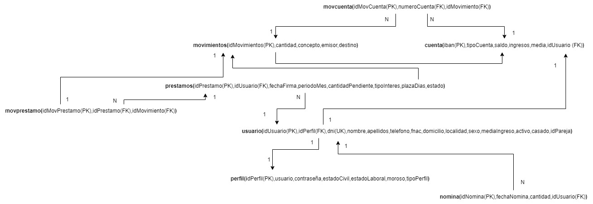
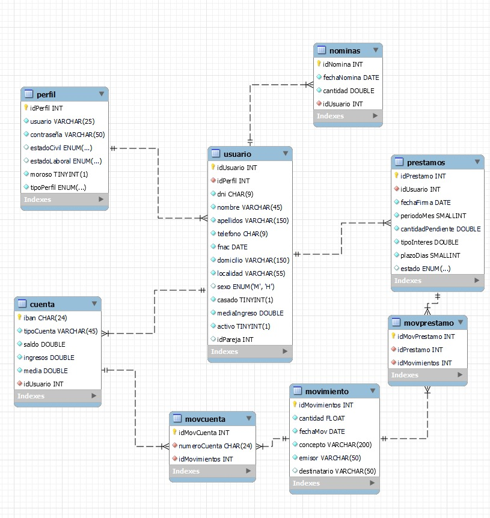
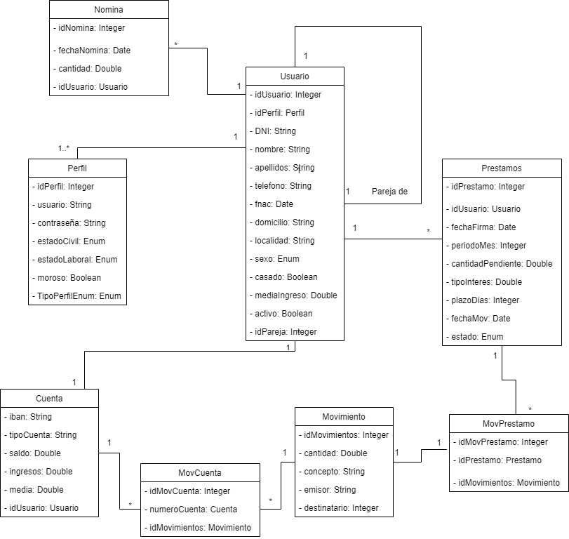

# PROYECTO INTERMODULAR- BETABANK- 

Proyecto Intermodular para el trabajo de fin de curso 2022/2023
## Componentes del equipo 🚀

  [Ginés Priede- Gestor](https://github.com/DAM132)

  [Ivan Diaz- Colaborador](https://github.com/ivaandiaz)

  [Ruben Gutierrez - Desarrollador](https://github.com/DAM122)

  [Pablo Paz - Analista](https://github.com/DAM122)

## Alcance  de la aplicación 🚀

 Objetivo: Desarrollar una aplicación para consultoría bancaria para determinar si los clientes tienen un préstamo preconcedido o no.
 
    -Aplicación en Java
    -Página web
    -Base de datos
    -Entornos de desarrollo
    -Sistemas Informáticos
  
  
**Diagrama de clases**

 

**ER**

**Diagrama entidad Relación**

**Memoria**
 
 -[22 de Mayo](https://github.com/DAM122)
  
  -[23 de Mayo](https://github.com/DAM122)
  
  -[24 de Mayo](https://github.com/DAM122)
  
  -[25 de Mayo](https://github.com/DAM122)
  
  -[26 de Mayo](https://github.com/DAM122)
  
  -[29 de Mayo](https://github.com/DAM122)

   
   
   
  
  
  
